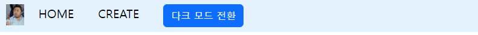
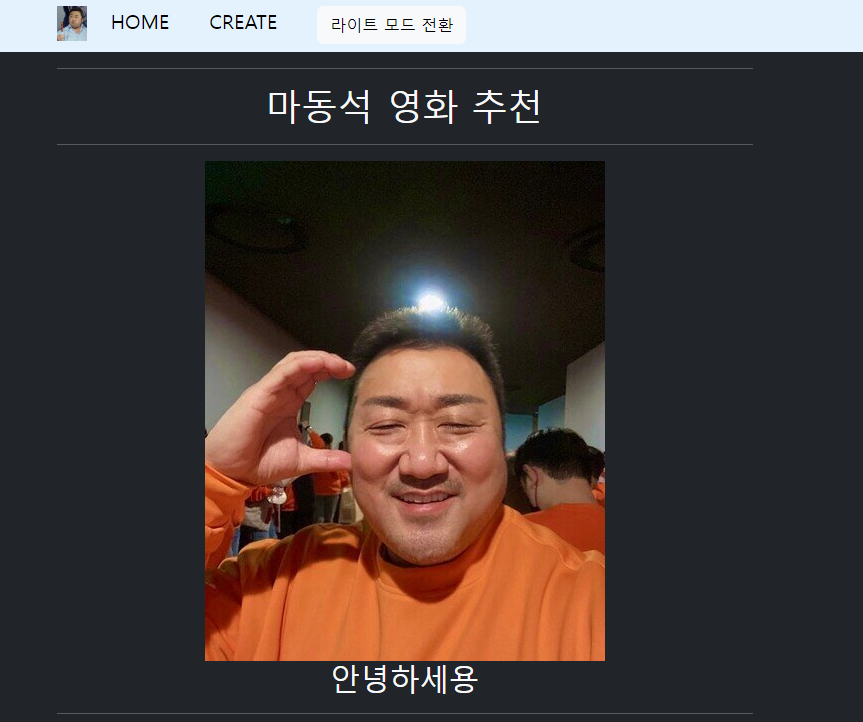
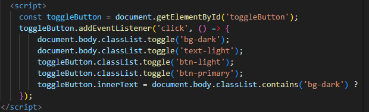
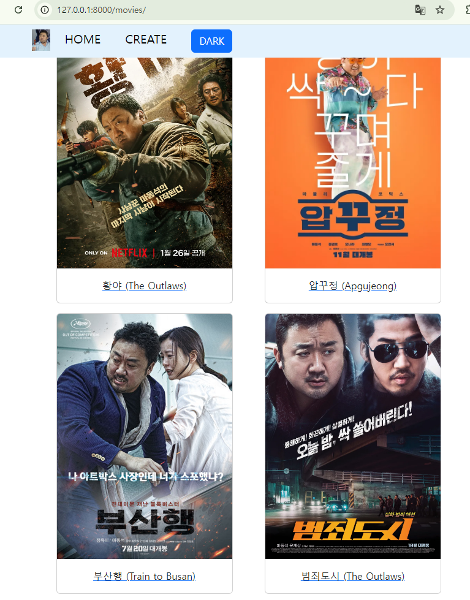
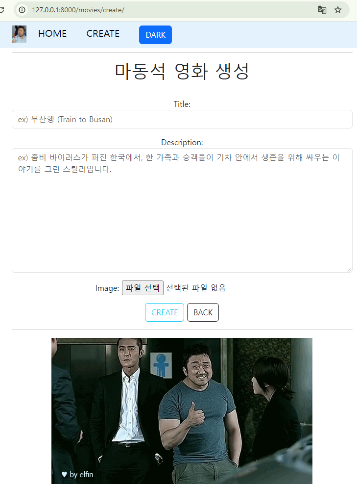
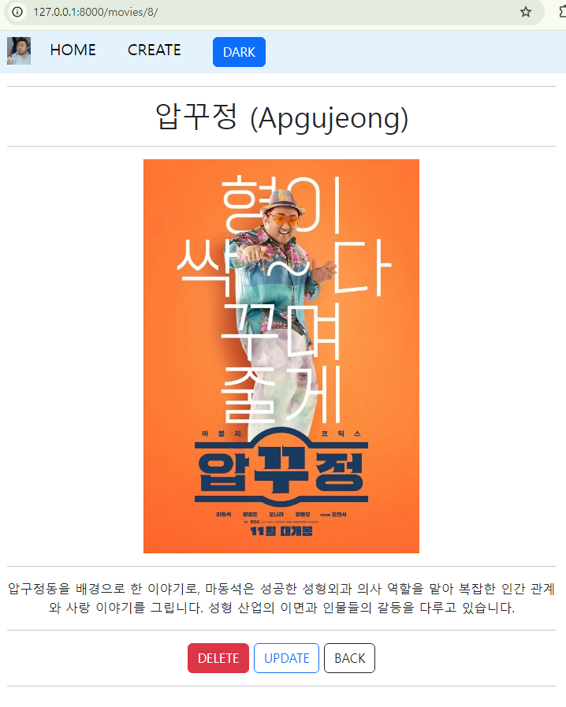
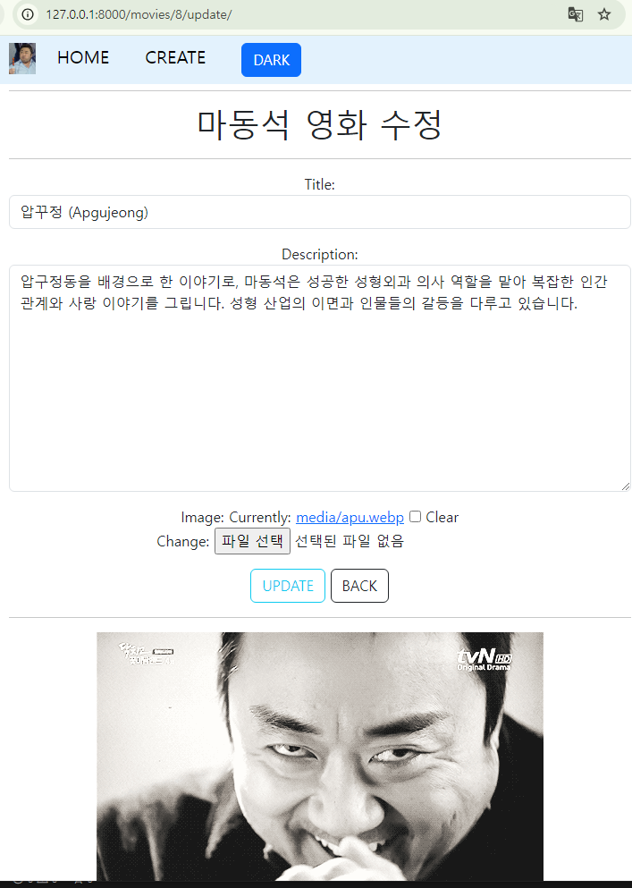

# PJT. 03 영화_마동석_영화소개_사이트


## NavBar

-   라이트 모드
  


-  다크 모드


    
-   고찰
   
    Navbar에 다크모드와 스티키 포지션을 적용했다. 

- Navbar

    ```html
    nav class="navbar sticky-top" style="background-color: #e3f2fd;">
      <div class="container text-center">
        <div class="row justify-content-start">
          
          <div class ="col">
            
          </div>
          <div class = "col" >
            <a class="navbar-brand" href="">HOME</a>
          </div>
          <div class = "col">
            <a class="navbar-brand" href="">CREATE</a>
          </div>
          <div class="col-auto me-auto">
            <button id="toggleButton" class="btn btn-primary">DARK</button>
        </div>
    ```
    


    하지만 다크모드를 적용할 때 자바스크립트를 사용해야했다. 자바스크립트 숙련도가 부족했고,
    사이트가 이동할 때마다 모드는 초기화되는 오류가 발생했다.

## INDEX

- 화면




- 코드

```html



<hr>
<h1>마동석 영화 추천</h1>
<hr>
<div>
  
  
</div>
<div>
  <h2>안녕하세용</h2>
</div>
<hr>
<div class='row justify-content-evenly'>

  <div class='col-5 mb-3'>

    <a href="">
      <div class="card" style="width: 18rem;">
        
        
        
        <div class="card-body">
          <p class="card-text">{{movie.title}}</p>
        </div>
      </div>
    </a>
  </div>
  
  
</div>

```
- 고찰 
    
    a 태그 안에 카드 전체를 넣어 모든 부분에서 detail url 경로로 이동하게 했다.

- index, detail logic

    ```python
    def index(request):
    movies = Movie.objects.all()
    context = {
        'movies' : movies,
    }
    return render(request, 'movies/index.html', context)

    def detail(request, pk):
    
    movie = Movie.objects.get(pk=pk)
    context = {
        'movie' : movie
    }
    return render(request, 'movies/detail.html', context)
    ```


## Create
- 화면


- 코드(HTML)
```html
create.html



<hr>
<h1>마동석 영화 생성</h1>
<hr>
<form method="POST" enctype='multipart/form-data'>
  
  {{form.as_p}}
  <input class="btn btn-outline-info" type="submit" value="CREATE">
  <a class="btn btn-outline-dark" href="" role="button">BACK</a>
</form>

<hr>


```

- 고찰

    enctype='multipart/form-data' 를 활용해 image파일을 전송할 수 있었습니다.
    또한 bootstrap을 활용하여 CREATE, BACK 아이콘을 꾸몄습니다.

- create logic

    ```python
    def create(request):
    if request.method == "POST":
        form = MovieForm(request.POST, request.FILES)
        if form.is_valid():
            movie = form.save()
            return redirect('movies:detail', movie.pk)
        
    else:
        form = MovieForm()
    context = {
        'form' : form,
    }
    return render(request, 'movies/create.html', context)
    ```

- 코드 (form)
```Python
class MovieForm(forms.ModelForm):
    title = forms.CharField(
        widget=forms.TextInput(
            attrs={
                'class' : 'form-control',
                'placeholder' : 'ex) 부산행 (Train to Busan)',
            }
        )
    )
    content = forms.CharField(
        label = 'Description',
        widget= forms.Textarea(
            attrs={
                'class' : 'form-control',
                'placeholder' : 'ex) 좀비 바이러스가 퍼진 한국에서, 한 가족과 승객들이 기차 안에서 생존을 위해 싸우는 이야기를 그린 스릴러입니다.',
            }
        )
    )
    class Meta:
        model = Movie
        fields = '__all__'
```
    forms 파이썬 파일에서 각 속성과 위젯을 적용시켜 input 라벨과 모양을 꾸몄습니다.


## Detail
- 화면


- 코드
```html
detail.html



<hr>
<h1>
  {{movie.title}}
</h1>
<hr>



<hr>
<p>
  {{movie.content}}
</p>
<hr>
<a class="btn btn-danger" href="" role="button">DELETE</a>
<a class="btn btn-outline-primary" href="" role="button">UPDATE</a>
<a class="btn btn-outline-dark" href="" role="button">BACK</a>
<hr>


```

- 고찰
    
    inline 스타일을 사용했습니다. height='500', 이를 통해 detail뷰의 사진 크기를 정의했습니다.

    bootstrap을 사용하여 DELETE와 UPDATE를 디자인했습니다.

- delete logic

    ```python
    def delete(request, pk):
    movie = Movie.objects.get(pk=pk)
    movie.delete()
    return redirect("movies:index")
    ```

## Update
- 화면


- 코드
```html
update.html



<hr>
<h1>마동석 영화 수정</h1>
<hr>
<form method="POST" enctype='multipart/form-data'>
  
  {{form.as_p}}
  
  <input class="btn btn-outline-info" type="submit" value="UPDATE">
  <a class="btn btn-outline-dark" href="" role="button">BACK</a>
</form>
<hr>



```

- update logic

    ```python
    def update(request, pk):
    movie = Movie.objects.get(pk=pk)
    if request.method == "POST":
        form = MovieForm(request.POST, request.FILES, instance=movie)
        if form.is_valid():
            movie = form.save()
            return redirect("movies:detail", movie.pk)
    else:
        form = MovieForm(instance=movie)
    
    context = {
        'movie' : movie,
        'form' : form,
    }
    return render(request, 'movies/update.html', context)
    ```


## Others
- Model 구성
```python
class Movie(models.Model):
    title = models.CharField(max_length=50)
    content = models.TextField()
    image = models.ImageField(blank=True, upload_to='media')
```


