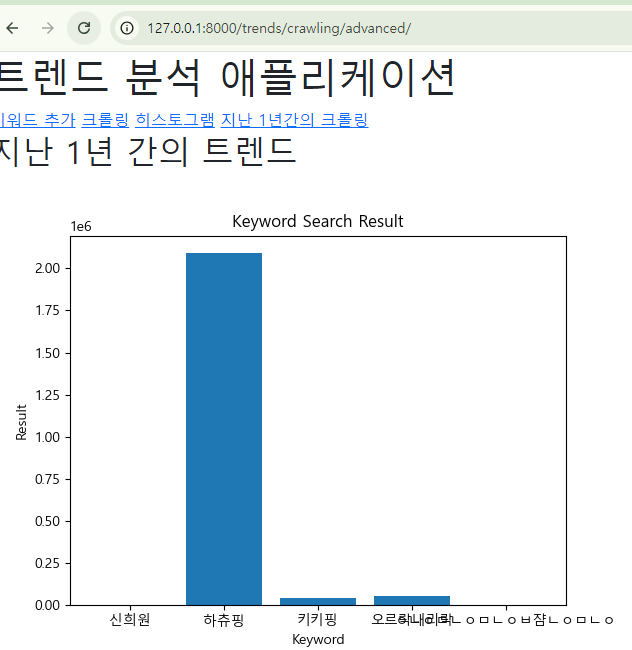

# PJT. 05 금융_키워드 검색량 분석을 위한 데이터 수집

## A - B Keyword, Trend

-   Keyword, Trend 모델 정의
  
```python
from django.db import models

# Create your models here.
class Keyword(models.Model):
    name = models.TextField()
    created_at = models.DateField(auto_now_add=True)

class Trend(models.Model):
    name = models.TextField()
    result = models.IntegerField()
    search_period = models.TextField()
    created_at = models.DateField(auto_now_add=True)
```

## URL

```python
from django.urls import path
from . import views
app_name= 'trends'

urlpatterns = [
    path('keyword/', views.keyword, name='keyword'),
    path('keyword/<int:pk>/', views.keyword_detail, name='delete'),
    path('crawling/', views.crawling, name='crawling'),
    path('crawling/histogram/', views.crawling_histogram, name='histogram'),
    path('crawling/advanced/', views.crawling_advanced, name='advanced'),
]
```
URL은 양식에 맞춰 기입했다.
## View
```python
from django.shortcuts import render, redirect
from .models import Trend, Keyword 
from bs4 import BeautifulSoup # 
from selenium import webdriver  # 크롤링 하기 위한 웹드라이버 설치
from .forms import KeywordForm
import matplotlib.pyplot as plt # 막대 그래프 시각화를 위해 설치
import numpy as np  
from io import BytesIO  # 이미지 파일을 변환하기 위해 설치
import base64 
# Create your views here.
import matplotlib as mpl  # 기본폰트에는 한글 변환이 되질 않는다.

# 폰트 설정
mpl.rc('font', family='Malgun Gothic')

# 키워드 생성
def keyword(request):
    keywords = Keyword.objects.all()
    if request.method == "POST":
        form = KeywordForm(request.POST)
        if form.is_valid():
            form.save()
            return redirect('trends:keyword')
    else:
        form = KeywordForm()
    context = {
        'form' : form,
        'keywords' : keywords,
    }
    return render(request, 'trends/keyword.html', context)

# 키워드 삭제
def keyword_detail(request, pk):
    article = Keyword.objects.get(pk=pk)
    article.delete()
    return redirect('trends:keyword')

# 크롤링 수행 및 크롤링.html 렌더링
def crawling(request):
    keywords = Keyword.objects.all()
    for keyword in keywords:
        keyword = keyword.name
        # keyword가 중복될 때 검색 결과 값만 +해주고 break로 순회를 멈췄습니다.
        if Trend.objects.filter(name=f"{keyword}", search_period="all"):
            keyword = Trend.objects.get(name=f"{keyword}", search_period="all")
            keyword.result += 1
            keyword.save()
            print('중복으로 결과를 추가합니다.')
            continue
        url = f'https://www.google.com/search?q={keyword}'
        driver = webdriver.Chrome()
        driver.get(url)

        html = driver.page_source
        soup = BeautifulSoup(html, "html.parser")

        result_stats = soup.select_one("div#result-stats")
        result =''
        # 검색 결과 값이 문자열과 시간초를 포함한 값이 나왔습니다.
        # 아래의 코드로 검색량만을 추출했습니다.
        for r in result_stats.text:
            if r.isdecimal():
                result += r
            elif r == "개":
                break
        result = int(result)
        # Trend 모델에 'all' 값으로 추가.
        Trend.objects.create(name=keyword, result=result, search_period="all")
    trends = Trend.objects.filter(search_period="all")
    context = {
        'trends' : trends,
    }
    return render(request, 'trends/crawling.html', context)

# 히스토그램 만드는 함수.
def crawling_histogram(request):
    results = Trend.objects.filter(search_period = "all")
    names = []
    values = []
    x = np.arange(len(results))
    for result in results:
        names.append(result.name)
        values.append(result.result)
    plt.clf()
    plt.bar(x, values)
    plt.xticks(x, names)
    plt.title('Keyword Search Result')
    plt.xlabel('Keyword')
    plt.ylabel('Result')

    buffer = BytesIO()
    plt.savefig(buffer, format="png")
    image_base64 = base64.b64encode(buffer.getvalue()).decode('utf-8').replace('\n', '')
    buffer.close()

    context = {
        'results' : results,
        'image' : f"data:image/png;base64, {image_base64}"
    }
    return render(request, 'trends/crawling_histogram.html', context)

# advanced 함수에서는 crawling과 히스토그램을 동시에 생성했습니다.
# crawling 함수와 crawling_histogram을 합치고 search_period의 값을 'year'로 변경한 차이가 있습니다.
def crawling_advanced(request):
    keywords = Keyword.objects.all()
    for keyword in keywords:
        keyword = keyword.name
        # 중복방지
        if Trend.objects.filter(name=f"{keyword}", search_period='year'):
            keyword = Trend.objects.get(name=f"{keyword}", search_period="year")
            keyword.result += 1
            keyword.save()
            continue

        url = f"https://www.google.com/search?q={keyword}&sca_esv=8a14761ebfeca0aa&sxsrf=ADLYWIJB-ppj3Q4oW6WSIVJR2wgGUWUvKg:1728023310192&source=lnt&tbs=qdr:y&sa=X&ved=2ahUKEwjR8sS8jPSIAxUodfUHHSx9AEkQpwV6BAgCEAs&biw=1161&bih=950&dpr=1"
        driver = webdriver.Chrome()
        driver.get(url)

        html = driver.page_source
        soup = BeautifulSoup(html, "html.parser")

        result_stats = soup.select_one("div#result-stats")
        result =''
        for r in result_stats.text:
            if r.isdecimal():
                result += r
            elif r == "개":
                break
        result = int(result)
        Trend.objects.create(name=keyword, result=result, search_period="year")
    results = Trend.objects.filter(search_period="year")
    # 이미지 생성
    names = []
    values = []
    x = np.arange(len(results))
    for result in results:
        names.append(result.name)
        values.append(result.result)
    plt.clf()
    plt.bar(x, values)
    plt.xticks(x, names)
    plt.title('Keyword Search Result')
    plt.xlabel('Keyword')
    plt.ylabel('Result')

    buffer = BytesIO()
    plt.savefig(buffer, format="png")
    image_base64 = base64.b64encode(buffer.getvalue()).decode('utf-8').replace('\n', '')
    buffer.close()

    context = {
        'image' : f"data:image/png;base64, {image_base64}"
    }
    return render(request, 'trends/crawling_advanced.html', context)
```

## Templates
- Base.html
```html
<!doctype html>
<html lang="en">
  <head>
    <meta charset="utf-8">
    <meta name="viewport" content="width=device-width, initial-scale=1">
    <title>Bootstrap demo</title>
    <link href="https://cdn.jsdelivr.net/npm/bootstrap@5.3.3/dist/css/bootstrap.min.css" rel="stylesheet" integrity="sha384-QWTKZyjpPEjISv5WaRU9OFeRpok6YctnYmDr5pNlyT2bRjXh0JMhjY6hW+ALEwIH" crossorigin="anonymous">
  </head>
  <body>
    <h1>트렌드 분석 애플리케이션</h1>
    <a href="">키워드 추가</a>
    <a href="">크롤링</a>
    <a href="">히스토그램</a>
    <a href="">지난 1년간의 크롤링</a>
    
    <script src="https://cdn.jsdelivr.net/npm/bootstrap@5.3.3/dist/js/bootstrap.bundle.min.js" integrity="sha384-YvpcrYf0tY3lHB60NNkmXc5s9fDVZLESaAA55NDzOxhy9GkcIdslK1eN7N6jIeHz" crossorigin="anonymous"></script>
  </body>
</html>
```
a 태그로 각 url을 요청했습니다.
- keyword.html
```html



<h2>키워드 추가</h2>
<form action=" " method="POST">
  
  {{form}}
  <input type="submit" value='생성하기'>
</form>
<hr>
<h3>분석을 원하는 키워드 목록</h3>

  <p>{{keyword.pk}}번째 키워드 - {{keyword.name}}</p>
  <form action="" method="POST">
    
    <input type="submit" value="삭제하기">
  </form>
  <hr>


```
keyword 추가 및 삭제하는 template.
    
- crawling.html

```html



<h2>크롤링 기초 - 전체 기간 검색 결과</h2>

<p>검색결과 : {{trend.name}} - {{trend.result}}개 / 검색일자 : {{trend.created_at}} </p>
<hr>



```
- crawling_histogram.html

```html



<h2>전체 기간 검색 결과 히스토그램</h2>


```
- crawling_advanced.html

```html



<h2>지난 1년 간의 트렌드</h2>


```

## 고찰
크롤링 기법을 배웠고, ORM과 시각화를 위한 모듈들(matplotlib, numpy) 등을 활용해 키워드 검색량 분석을 수행했습니다.
로직을 만드는 과정에 파이썬의 반복문과 제어문을 사용해야 했습니다. 사용하는 언어의 문법의 기본이 중요하다 깨달았고, 복습 또한 꾸준히 하겠다고 다짐했습니다.
프로젝트 진행 중 생각한 것들은 주석에 담겨있습니다.